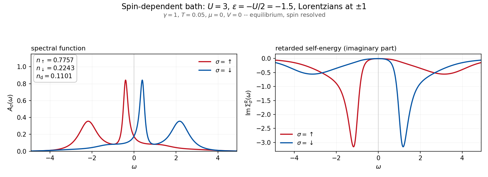

# neq-kk-ipt-solver

A Kajueter-Kotliar Iterated Perturbation Theory (IPT) [Phys. Rev. Lett. 77, 131 (1996)]
impurity solver for arbitrary filling extended to nonequilibrium (Keldysh)
steady states, with an optional Potthoff-Wegner-Nolting [Phys. Rev. B 55,
16132 (1997)] m=3 moment band-shift correction. See "Accuracy and
limitations" below for where the method has been benchmarked and where it has
not.



<sub>A per-flavor bath — Lorentzians centred at `+1` for spin up and `-1` for
spin down — in equilibrium, with a spin-independent onsite energy at the
particle-hole symmetric point. The solution is nonetheless strongly polarized.
Produced by
[`examples/05_spin_dependent_hybridization.py`](examples/05_spin_dependent_hybridization.py);
four further setups, including a voltage-biased steady state, are in
[`examples/`](examples/).</sub>

This version has been authored by Tommaso Maria Mazzocchi and used to generate 
the results discussed at this link: https://doi.org/10.48550/arXiv.2604.15942.
The preprint is currenly undergoing peer review in Phys. Rev. B and the DOI
will be updated as soon as the manuscript gets published in the journal.
The full dataset is available at: https://repository.tugraz.at/records/xz6v9-9jp08.

## Citing this code

This solver is released under the MIT license because we believe in open
science: the code should be freely available for anyone to inspect, use,
reuse, and build on, with no strings attached.

That said, if this solver is useful to your own work, we would be very
pleased — and would greatly appreciate — a citation of the paper it was
originally written for:

> T. M. Mazzocchi and E. Arrigoni, "Extension of the iterated perturbation
> theory at arbitrary fillings to nonequilibrium steady states",
> arXiv:2604.15942 (2026).
> https://doi.org/10.48550/arXiv.2604.15942

This preprint is currently under peer review in Phys. Rev. B; the reference
above will be updated to the published journal version once it is available.

## Physics background

The solver implements the Kajueter-Kotliar [Phys. Rev. Lett. 77, 131 (1996)]
interpolative self-energy ansatz for the single-impurity Anderson model,
generalized away from half-filling and particle-hole symmetry, and formulated
on the Keldysh contour so it applies equally to equilibrium and nonequilibrium
(e.g., voltage- or temperature-biased) steady states.
Given a hybridization function Delta(w) (retarded and Keldysh components)
and Hubbard interaction U, it solves a coupled 4-dimensional nonlinear root
problem (auxiliary chemical potential mu0 and occupation n, for each spin flavor)
to determine the impurity self-energy and Green's function self-consistently.

An optional correction (`use_potthoff_band_shift`) adds the nonequilibrium
Keldysh analogue of the Potthoff-Wegner-Nolting m=3 moment band-shift term
[Phys. Rev. B 55, 16132 (1997)] to the self-energy.

## Installation

Recommended: install into a dedicated virtual environment, so this
project's dependencies stay isolated from anything else on your machine.

```bash
git clone https://github.com/mazzocch/neq-kk-ipt-solver.git
cd neq-kk-ipt-solver
python3 -m venv .venv
source .venv/bin/activate    # on Windows: .venv\Scripts\activate
pip install .
```

For development (editable install + running the tests):

```bash
pip install -e ".[test]"
pytest
```

(If you're using an editor with a Python language server -- e.g. VS Code
with Pylance -- point it at `.venv`'s interpreter, or imports like `numpy`
will show as unresolved even though everything installed correctly.)

## Quickstart

```python
from neq_kk_ipt_solver import Solver

input_data = {
    "global_parameters": {
        # N_points/w_max: see "Numerical considerations / caveats" below --
        # these two values are a good, safe default, not just a fast toy grid.
        "N_points": 10001,
        "w_max": 50.0,
        "U": 3.0,
        "flavors": ["up", "down"],
    },
    "solver": {
        "static": {
            "spin_sym": True,
            "ph_sym": True,
        },
        "modifiable": {},
        "dynamic": {
            # Flat-DOS (semi-elliptic-like) reservoir hybridization
            "T": 0.05,
            "T_fict": 0.05,
            "D_l": 10.0,
            "D_r": 10.0,
            "t_l": 1.0,
            "t_r": 1.0,
            "mu": 0.0,
            "V": 0.0,
            "output_dir": "./out",
        },
    },
}

solver = Solver(input_data)
sol = solver.solve()

print("Converged:", sol.success)
print("Occupations:", solver.n_occ)
print("Double occupancy:", solver.n_double)

solver.store_output()  # writes ./out/solver_output_<timestamp>.json
```

## Examples

Five worked setups live in [`examples/`](examples/), each a runnable script
that solves one system, reports the occupations and double occupancy, and
plots the spin-resolved spectral function and retarded self-energy:

```bash
pip install ".[examples]"     # adds matplotlib
python examples/01_half_filling.py
```

They cover half filling, near and far from half filling, a voltage-biased
nonequilibrium steady state, and a spin-dependent (per-flavor) hybridization.
See [`examples/README.md`](examples/README.md) for the figures and a summary of
what each one demonstrates.

## Parameter reference

### `global_parameters`

| Key | Type | Required | Description |
|---|---|---|---|
| `N_points` | integer | yes | Number of points in the frequency grid. |
| `w_max` | number | yes | Maximum frequency; the grid spans `[-w_max, w_max]`. |
| `U` | number | yes | Hubbard interaction strength. |
| `flavors` | array of strings | yes | The two spin flavors, e.g. `["up", "down"]`. Exactly 2 are required. |
| `strict` | boolean | no | If `true`, raises on JSON-schema validation failure instead of warning. Default `false`. |

### `solver.static`

| Key | Type | Default | Description |
|---|---|---|---|
| `store` | boolean | `true` | Whether `store_output()` actually writes anything. |
| `spin_sym` | boolean | `true` | Enforce spin symmetry (both flavors share the same onsite energy). |
| `ph_sym` | boolean | `true` | Enforce particle-hole symmetry (`impurity_onsite_e = -U/2` for both flavors, when combined with `spin_sym`). |
| `use_potthoff_band_shift` | boolean | `false` | Enable the Potthoff-Wegner-Nolting m=3 moment band-shift correction. `false` reproduces the plain KK-IPT-n0 scheme. |
| `band_shift_inner_maxiter` | integer | `30` | Max inner fixed-point iterations for the interacting band shift `B_tilde` (only used if the above is `true`). |
| `band_shift_mixing` | number | `0.5` | Linear mixing factor in (0, 1] for that inner iteration. |
| `band_shift_tol` | number | `1e-8` | Convergence tolerance (max change in `B_tilde`) for that inner iteration. |
| `max_restarts` | integer | `5` | Extra starting points tried if the coupled root solve fails. `0` disables restarts. |
| `on_convergence_failure` | string | `"raise"` | `"raise"` reports the failure and raises `ConvergenceError`; `"warn"` only prints and returns the non-converged result. |
| `residual_tol` | number | `1e-6` | Acceptance tolerance on the residual norm. An attempt counts as converged only below this, whatever the optimizer's own flag says. |

### `solver.modifiable`

| Key | Type | Description |
|---|---|---|
| `impurity_onsite_e` | object | Per-flavor onsite energy, e.g. `{"up": -1.5, "down": -1.5}`. Set automatically when `ph_sym` and `spin_sym` are both `true`. |

### `solver.dynamic`

Exactly one of the following four hybridization specifications must be given, plus `output_dir`. They are tried in the order listed.

**1. Explicit hybridization arrays** (fully general):

| Key | Type | Description |
|---|---|---|
| `Delta_R_im` | object | Imaginary part of the retarded hybridization, per flavor (e.g. `{"up": [...], "down": [...]}`). The real part is reconstructed via Kramers-Kronig. |
| `Delta_K_im` | object | Imaginary part of the Keldysh hybridization, per flavor. |

**2. Semicircular (semi-elliptic) hybridization** (single number = spin-symmetric, or per-flavor dict = spin-dependent):

| Key | Type | Description |
|---|---|---|
| `Delta_D` | number or object | Half-bandwidth(s) of the semicircle (must be positive). Mutually exclusive with `Delta_gamma`. |
| `Delta_center` | number or object | Center(s) of the semicircle. Required, as for the Lorentzian — pass `0` for a band centered on zero. |
| `Delta_eta` | number or object | Constant broadening subtracted from `Im Delta^R`, removing the hard zeros outside the band. Optional, default `0`. See below. |
| `mu` | number | Chemical potential of the hybridization/bath. |
| `V` | number | Applied voltage bias between the two leads (`mu_l = mu + V/2`, `mu_r = mu - V/2`). |

Normalized to unit total spectral weight, like the Lorentzian below, so the peak
strength is `Gamma = -Im Delta^R(center) = 2/Delta_D` — a semicircle matching a
given `Gamma` needs `Delta_D = 2/Gamma`. For any other normalization, pass
`Delta_R_im`/`Delta_K_im` directly.

`Delta_eta` exists because a bare semicircle has `Im Delta^R` *exactly* zero
outside the band, which turns any impurity feature landing there into a true
bound state — see "Numerical considerations" below. A small constant floor
gives such states a resolvable width. It is not free: the floor is a weak flat
band spanning the whole grid, so it adds `2*w_max*eta/pi` to the hybridization
weight `D_1` (about 19% at `eta=0.01`, `w_max=30`) and makes `D_1` depend on
`w_max`. `D_2` is unaffected. As a guide, at `Delta_D=2`, `U=4`,
`N_points=10001`, `w_max=30`: `eta=0.001` is not enough (`int A` still 0.998),
`eta=0.005`–`0.01` restores `int A` to 0.99999 and every sum rule. Keeping the
bath bandwidth comfortably larger than `U` avoids the problem entirely and
leaves `D_1 = 1` exact, so prefer that when you can.

**3. Lorentzian hybridization** (single number = spin-symmetric, or per-flavor dict = spin-dependent):

| Key | Type | Description |
|---|---|---|
| `Delta_center` | number or object | Center(s) of the Lorentzian. |
| `Delta_gamma` | number or object | Width(s) of the Lorentzian (must be nonzero). |
| `mu` | number | Chemical potential of the hybridization/bath. |
| `V` | number | Applied voltage bias between the two leads (`mu_l = mu + V/2`, `mu_r = mu - V/2`). |

**4. Flat-DOS reservoir** (fallback if none of the above is given):

| Key | Type | Description |
|---|---|---|
| `T_fict` | number | Fictitious inverse temperature shaping the flat DOS. |
| `D_l`, `D_r` | number | Half-bandwidths of the left/right leads. |
| `t_l`, `t_r` | number | Hopping amplitudes to the left/right leads. |
| `mu`, `V` | number | As above. |

Common to all three:

| Key | Type | Description |
|---|---|---|
| `output_dir` | string | Directory `store_output()` writes results into. Required. |

## Numerical considerations / caveats

**The frequency grid (`N_points`, `w_max`) has to be wide and fine enough,
or results silently degrade rather than error out.** The solver works
entirely in the frequency domain, and two of its key steps rely on the
imaginary parts of the relevant functions having already decayed to
(near) zero well before the edges of the grid:

- The IPT self-energy diagram is built by convolving the Weiss field with
  itself (`scipy.signal.convolve`, in `_calc_IPT_diagram`). If the Weiss
  field's imaginary part hasn't decayed by the grid edges, the convolution
  suffers boundary/wrap-around effects.
- The real part of every retarded quantity (`G0`, the IPT diagram, `Sigma`)
  is reconstructed from its imaginary part via the Kramers-Kronig relation
  (`KK()`, a padded Hilbert transform). This reconstruction degrades the
  same way once the tails aren't negligible at the edges.

In practice, `w_max` needs to be large relative to `U` and the
hybridization bandwidth for this decay to actually happen, and `N_points`
needs to be fine enough to resolve the resulting features once it has.
**`N_points=10001` and `w_max=50` (used throughout this repo's own test
fixtures) is a good, safe starting point** for most `U`/`T`/bandwidth
combinations of interest. Smaller grids (e.g. for a quick interactive check)
can converge and report `success=True` while still being quietly
inaccurate -- there is no built-in check for this, so it is worth
confirming that the relevant spectral weight has actually decayed near
`+/-w_max` before trusting a result computed on a coarser grid.

**Hybridizations with a hard band edge can produce bound states the grid
cannot represent.** The semicircular option (and any `Delta_R_im` you supply
that vanishes identically outside some window) has `Im Delta^R = 0` beyond the
band, so an impurity feature landing there — typically a Hubbard band, when `U`
is large compared with the bath bandwidth — becomes a genuine bound state, a
delta function on the real axis. On a frequency grid that shows up as a very
tall, very narrow peak whose weight is under-counted: with `Delta_D=2`, `U=4`
and `N_points=10001`, the upper Hubbard band sits near `w = +5.9` outside the
band and `int A(w) dw` drops to ~0.97 instead of 1, which then breaks every sum
rule. Checking `int A(w) dw == 1` is the fastest way to detect this.

There are three fixes, in rough order of preference: keep the bath bandwidth
comfortably larger than `U`, so nothing lands outside the band and `D_1` stays
exactly 1; set `Delta_eta` (0.005–0.01 on the grid above) to give the state a
resolvable width, at the cost of a `w_max`-dependent shift in `D_1`; or refine
the grid until the peak is resolved (`N_points=80001` restores `int A` to
0.99999 in the case above, which is expensive). The flat-DOS reservoir is
immune either way — its `T_fict` edge smearing leaves `Im Delta^R` nonzero
everywhere.

**The spectral moment sum rules are a much more sensitive grid diagnostic than
the occupations.** `n` and `n_double` are `w^0`-weighted integrals of
integrands that are already negligible in the tails, and are correspondingly
insensitive to the grid: over a 4x range in `w_max` and an 8x range in
resolution they do not move in the sixth decimal. The moments carry a `w^m`
weight, which amplifies exactly the tail region where the numerics are
weakest, so if the `m=3` sum rule is converged the occupations are converged
with a large margin. See `scripts/check_spectral_moments.py`.

## Non-convergence

A root solve that stops without finding a solution still leaves a Green's
function, a self-energy and occupations on the solver. They are not a solution
of the impurity problem, and consuming them silently corrupts every subsequent
iteration of an outer loop such as DMFT. The solver therefore does three things:

1. **Retries.** If the first solve fails, up to `max_restarts` further starting
   points are tried: a cold start, a Weiss field aligned with the
   Hartree-shifted impurity level, two oppositely polarized guesses, a switch to
   Levenberg-Marquardt, and finally seeded jitter around the original guess. The
   sequence is deterministic. Whatever happens, the state left on the solver is
   rebuilt from the attempt with the *smallest* residual, not merely the last.

2. **Judges convergence by the residual, not by the optimizer's flag.** An
   attempt counts as converged only if `|residual| <= residual_tol`. This is not
   pedantry: scipy's Levenberg-Marquardt reports success as soon as it stops
   making progress, and will do so at points that are not roots — at `U=10` with
   a strongly polarized start it returns success with `|residual| ~ 1e-2`,
   against `~1e-12` for the genuine solution, and the m=1 sum rule is then off by
   6e-2 instead of 1e-4. `sol.success` is overwritten to reflect the residual
   test; the optimizer's own verdict is preserved as `sol.scipy_success`.

3. **Fails loudly.** If nothing converges, the failure is printed and a
   `ConvergenceError` is raised, so a non-solution cannot propagate. Set
   `on_convergence_failure` to `"warn"` to get the non-converged result back
   instead — appropriate for diagnostic sweeps that deliberately probe unstable
   regions and record the outcome, not for production runs.

After `solve()`, `solve_attempts`, `solve_strategy` and `solve_residual` record
how many starting points were tried, which one won, and the residual achieved.

## API overview

- `Solver(input_data)` — construct and validate a solver instance from the JSON-schema-checked input above.
- `Solver.solve(maxfev=1000, res_tol=1e-8)` — solves the coupled nonlinear system; returns the `scipy.optimize.OptimizeResult`. Populates `n_occ`, `n_double`, `GF`, `SE`, `G0`.
- `Solver.calc_occupations()` — (called internally by `solve()`) computes occupations and the exact Keldysh Galitskii-Migdal double occupancy, valid both in and out of equilibrium.
- `Solver.store_output()` — writes a JSON file with the full solution (Green's functions, self-energy, occupations, input parameters, git-commit provenance).
- `Solver.set_Delta_external(Delta)`, `Solver.set_onsite_energies_external(...)` — for embedding this solver inside a larger self-consistency loop (e.g. DMFT), where the hybridization/onsite energy are supplied externally each iteration instead of built once from `solver.dynamic`.

### `neq_kk_ipt_solver.moments`

Spin-resolved spectral moment sum rules, valid in and out of equilibrium.

- `check_sum_rules(solver)` — per-flavor comparison of the closed-form `m=1,2,3` moments against the numerically integrated `int dw w^m A(w)`, plus the `m=0` normalization.
- `closed_form_moments(solver, fl)` — the closed forms alone.
- `spectral_moments(w, GF_R, orders)` / `hybridization_moments(w, Delta_R, kmax)` — the raw integrals.
- `band_shift_correlator(w, GF, SE, Delta, U)` — the Potthoff-Wegner-Nolting band-shift correlator that the `m=3` rule needs, returned raw (not divided by `n(1-n)`).

`m=1` and `m=2` close on the occupations alone and are therefore external
benchmarks. `m=3` additionally needs the band-shift correlator, which is a
functional of the converged solution rather than an independently known
quantity, so that one is a consistency check between two different routes to
the same number — which is exactly what makes it sensitive to whether the
self-energy ansatz carries the right `m=3` structure.

`scripts/check_spectral_moments.py` runs the whole comparison at `V=1`.

## Accuracy and limitations

The core scheme is validated against the published benchmarks in the papers
above. Beyond that, two things are worth stating plainly.

**The band-shift correction is benchmarked in the paramagnetic case, where it
changes nothing.** For a spin-independent hybridization and onsite energy, the
Potthoff-corrected solver has been compared against AMEA and gives results
indistinguishable from plain KK-IPT-n0. The correction is therefore verified
not to break the case that was already known to work, but that comparison
cannot tell you what it is worth, because there is nothing for it to fix there.

**For a spin-dependent hybridization, agreement with AMEA holds only up to
about `U = 4`.** Beyond that, both KK-IPT variants develop a change in which
spin is the majority species as `U` grows, and AMEA does not: it keeps the same
majority spin across the whole range. The KK-IPT behaviour is not a bug in this
implementation -- the solution is unique at each `U`, is reached from any
starting point, and satisfies the `m=1` and (with the correction) `m=3` sum
rules to the numerical floor -- but it is a limitation of the ansatz. Treat
spin-dependent results at strong coupling as qualitative, and prefer a
controlled solver if the polarization itself is the quantity of interest.

## Status

This is a v0.2.0 extraction from a larger research codebase. The core physics
has been validated against published benchmarks (see the papers above). The
packaging and documentation are deliberately modest; the test suite is not --
`pytest` runs 94 tests in about 45 seconds, and they are the main reason to
trust a change to this code.

**Physics regression.** Three fixtures pin previously computed results and are
reproduced exactly: equilibrium (U=5.5, T=0.05, two impurity levels),
voltage-biased nonequilibrium (U=4, T=0.1175, V=1.0, two impurity levels), and
a spin-dependent hybridization in equilibrium (Lorentzians centred at +/-1,
two temperatures, two U straddling a change in the majority spin). The first
two benchmark the full Green's function and self-energy for both flavors, not
just the scalar observables. Alongside the pinned numbers the suite asserts
properties that hold independently of any fixture -- the spectral
normalization, and the exact `n_up + n_down = 1` imposed by the combined
particle-hole x spin-flip symmetry of the spin-dependent setup.

**Sum rules.** The spin-resolved spectral moments (`neq_kk_ipt_solver.moments`)
give an independent check that does not rely on any stored reference. `m=1`
and `m=2` close on the occupations alone and hold to better than 1e-4 for both
self-energy schemes. `m=3` does not close: it additionally needs the
Potthoff-Wegner-Nolting band-shift correlator, which is exactly what that
correction supplies. Plain KK-IPT-n0 violates it -- by a few percent for the
flat-DOS reservoir at V=1, and by tens of percent for a spin-dependent
hybridization at strong coupling -- while the corrected scheme satisfies it to
the numerical floor, three to four orders of magnitude better. The deviation is
flat in both `w_max` and grid spacing, so it is a property of the ansatz and
not a numerical artifact. This validates the correction against the moment it
is constructed from, which verifies the implementation rather than the physics:
the informative quantity is the size of the defect in the uncorrected scheme.
See "Accuracy and limitations" above for what the comparison against AMEA does
and does not establish.

**Convergence.** A separate group of tests covers the restart ladder and the
refusal to return a non-solution, including the case that motivated it -- an
optimizer reporting success at a point that is not a root.

What is *not* covered: agreement with a numerically exact solver. Every physics
test asserts reproduction, not correctness. IPT is a controlled approximation,
and what the suite pins is what this scheme converges to.

## License

MIT — see [LICENSE](LICENSE).
