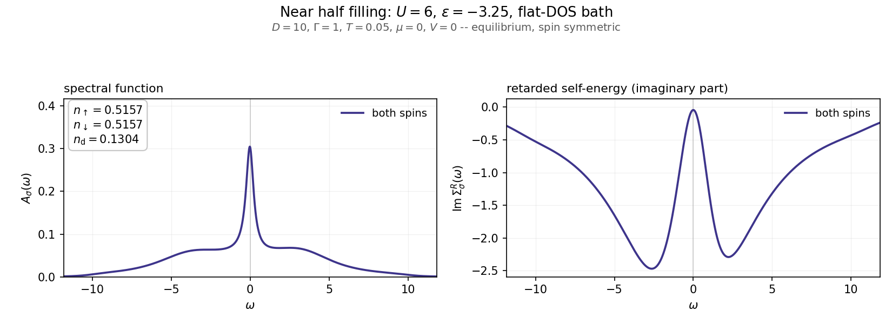
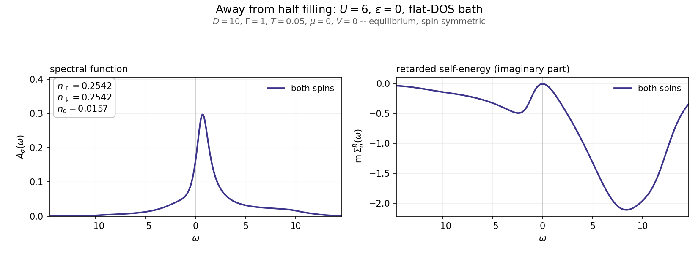
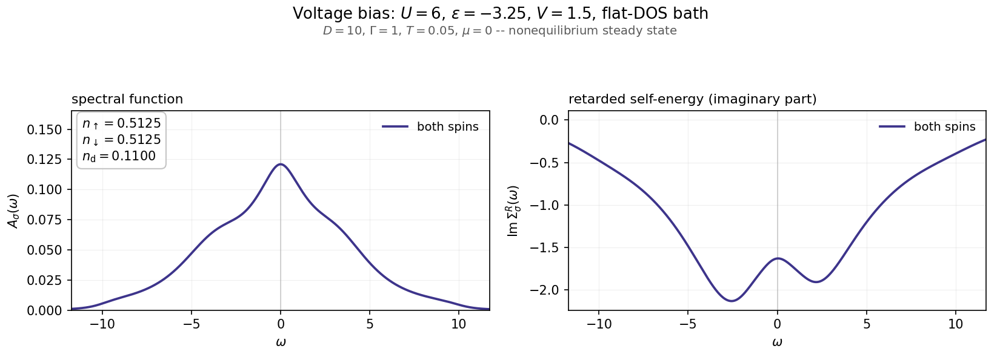

# Examples

Five self-contained scripts, each a complete study of one setup. They exist to
show how to reach the different hybridizations and regimes the solver supports,
and what the answers look like.

Each one solves the impurity problem, prints the occupations and double
occupancy, and writes a figure to `output/` showing the spin-resolved spectral
function $A_\sigma(\omega)$ and the imaginary part of the retarded self-energy, with
$n_\uparrow$, $n_\downarrow$ and $n_d$ annotated on the plot. Where the two spins are
equivalent, a single curve is drawn rather than two identical ones.

Plotting needs matplotlib, which is not a dependency of the solver itself:

```bash
pip install ".[examples]"
python examples/01_half_filling.py
```

Every example runs on the recommended production grid (`N_points=10001`,
`w_max=50`) and takes a couple of seconds. Each exposes a `build_input()`
function, so an example can also be used as a starting point in your own script
without running its plotting.

## The examples

| | setup | what it shows |
|---|---|---|
| [01](01_half_filling.py) | $U=6$, $\epsilon=-U/2$, box-shaped-DOS bath, equilibrium | the particle-hole symmetric point: $n=1/2$, symmetric spectrum, sharp quasiparticle peak between two Hubbard bands |
| [02](02_near_half_filling.py) | $U=6$, $\epsilon=-3.25$, same bath | slightly above half filling; the spectrum loses its symmetry but keeps the three-peak structure |
| [03](03_away_from_half_filling.py) | $U=6$, $\epsilon=0$, same bath | far from half filling, where the Kajueter-Kotliar interpolation earns its keep; $n_d$ collapses to $0.016$ |
| [04](04_voltage_bias.py) | $U=6$, $\epsilon=-3.25$, same bath, $V=1.5$ | a genuine nonequilibrium steady state; compare $n_d$ with 02 to see the bias suppress it |
| [05](05_spin_dependent_hybridization.py) | $U=3$, $\epsilon=-U/2$, Lorentzians centred at $+1$ (up) and $-1$ (down) | a per-flavor bath, and the strong spin polarization it produces even with a spin-independent onsite energy in equilibrium |

Examples 01--04 use the box-shaped-DOS reservoir with half-bandwidth $D=10$
and $t_l = t_r = 1/\sqrt{2}$, so that $\Gamma = -\mathrm{Im}\,\Delta^R(0) = 1$. That is the
convention used throughout the accompanying paper, and it makes $U$ and $T$
directly readable in units of $\Gamma$.

## Results

### 01 -- half filling


### 02 -- slightly above half filling


### 03 -- far from half filling


### 04 -- voltage-biased steady state


### 05 -- spin-dependent hybridization


Example 05 is worth a comment. The onsite energy is spin independent and the
system is in equilibrium, yet the solution is strongly polarized
($n_\uparrow = 0.78$, $n_\downarrow = 0.22$). The two spins see *identical* broadening at
the Fermi level, $\Gamma_\uparrow(0) = \Gamma_\downarrow(0)$, so this is not a density-of-states
effect: it is driven entirely by the real part of the hybridization, which acts
as a static exchange field $\mathrm{Re}\,\Delta^R_\sigma(0) = \mp 0.5$. See the note on
accuracy in the main README before reading too much into the spin-dependent
case at larger $U$.

## Regenerating

```bash
for f in examples/0*.py; do python "$f"; done
```

The figures in `output/` are committed so the table above renders without
running anything.
